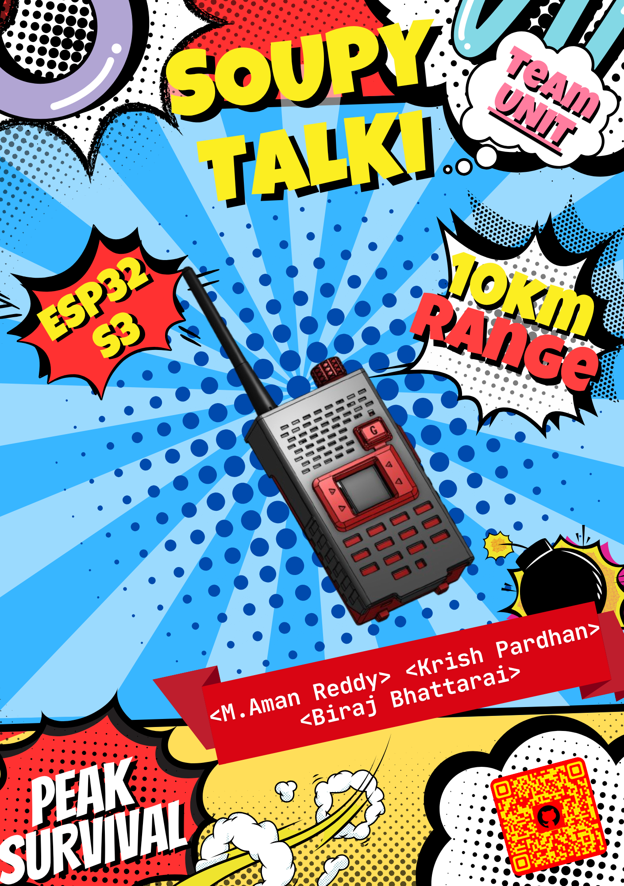
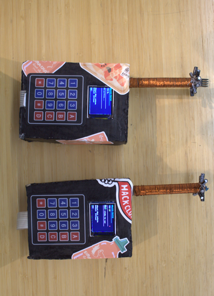
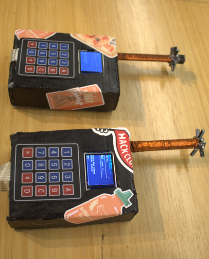
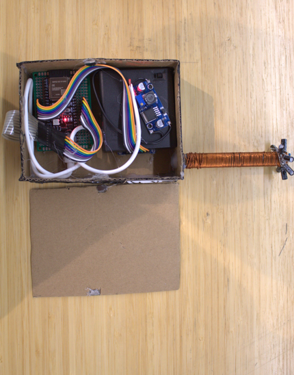

# Soupy-Talki
The most important thing you need to survive the apocalypse , we need to survive this!!!! 

**Alrr so to survive an apocalypse the thing that increases the survaival chances of us and soup is communication!!! so we the team UNI-T decided to build the soupy talki , a long range commuunication device that you can use to communicate and survive!!**

we are not putting INSTA on this or else you will be doom scrolling when the **DOOM** gets to you

---

## What it is (a bomb that looks like a walki talki desguised to kill you)

- Wo its a walki takli made with 2 ESP32 S3 N16R8 that communicate with each other using LoRa modules 
- Can get a maximum range of 12Km and and 10Km with interfearance 
- Can be powered using anything lol but use a powerbank for the best out put (its like a 2 in one where you have a power bank with you all times and it does   not pull that much power so you'll have plenty left in the power bank to charge other things. and you will have to carry less weight)
- Onboard leds for signal strength indication and the power bank indiactes the battery level so we dont have to aff that
- has a matrix keypad so that it will be able to text
- has 2 usd-c ports for debuggin and other stuff

---

## Why are we building this??

so we are in Shenzen , China!!! for a 7 Day hardware hackathon!! by Hackclub , Fallout (the best hackathon everrr) the theme is the world ends in 7 days and we get to build whatever we want!! **BUT** we are **ENGINEERS** we cant give up that easily so we have decided to build a Soupy Talki ( Soup is the mascot of this event hence the name soupy talki )  the soupy talki helps you communicate and coordinate with your friends, family and who ever has the soupy talki which increases your chances of survaival by a *Lot*

---

## Features
1. Texting!!
2. Vibration when you recive a message
3. Text to speech , so you dont have to waste time when your surviving and survive lol
4. A display so you can see everything you recieve
5. A keypad so you can chat and escape

---

## How to use it 

so basically you have the button matrix and you type and click send

## Zine Page

---

## Images

Top side

Side side 

Back side 

